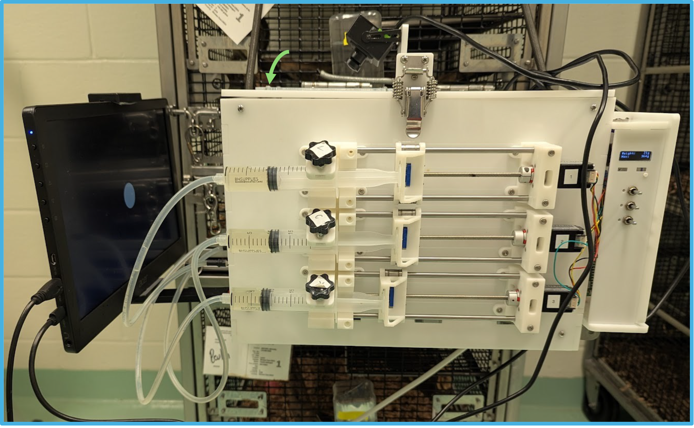

# ShrewBox
# Modular Behavior Box for Small Animal Experiments

## Overview
We developed a low-cost, customizable behavior box designed for conducting animal experiments, particularly in tree shrews and other small animals. This modular platform allows precise control over stimulus presentation and reward delivery while animals maintain access to their home cage. It expands the methodological toolkit for investigating complex behaviors in a controlled yet naturalistic environment.

## Features
- **Precision Reward Delivery**: Stepper motors provide fine control (0.11° step rotation) of reward amounts with individual channel control, reducing wear and tear.
- **Enhanced Visual Stimuli**: Larger monitors with adjustable viewing angles and distances ensure optimal stimulus presentation.
- **Capacitive Touch Pads**: Enables animals to indicate choices while maintaining gaze at the screen, allowing precise tracking of body position.
- **Compact and Integrated**: Raspberry Pi 4 replaces external computers, reducing footprint and minimizing the number of Arduinos and wires. All components are mounted directly on the box.
- **Refined Construction**: Laser-cut and 3D-printable components simplify assembly while enabling modular expansion.
- **Scalability**: Daisy chain multiple behavior boxes to the same power source for simultaneous experiments.
- **Open-Source Experiment Control**: Runs on Python-based PsychoPy, making it accessible and customizable.
- **Integrated Weight Monitoring**: Improved onboard weight scale for tracking animal weight in real time.
- **Affordable**: Total cost is approximately $950.

## Assembly and Usage
We are currently developing detailed written instructions and instructional videos for assembling and using the behavior box. These will be available in this repository soon. In the meantime, groups interested in the behavior box should reach out to us directly for more information.

Currently, this repository provides:
- 3D files for 3D printing
- Files for laser-cut panels
- Bill of materials
- Source code for the capacitive touch sensor
- Source code for controlling Arduinos that interface with the stepper motor and weight sensors

## Photo

## Contributions
This project is open-source, and we welcome contributions! If you have improvements or modifications, feel free to submit a pull request or open an issue.

---
For inquiries, please contact the [Arcaro Lab](https://arcarolab.com).
